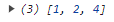

# Array

## Methods

```javascript
/* 변수 */
const numbers = [1, 2, 3, 4]
const fruits = ['Apple', 'Banana', 'Cherry']
```

- forEach() : 배열 요소 한번씩 실행
```javascript
fruits.forEach((element, index, array) => {
    console.log(element, index, array)
})
```
- map() : 배열 내의 모든 요소를 호출한 결과를 모아 새로운 배열을 반환
```javascript
fruits.map((element, index, array) => {
    return console.log(element, index, array)
})
```
- filter() : 주어진 배열에 대한 얕은 복사본을 생성, true인 필터링 된 새로운 배열데이터 출력
```javascript
fruits.filter((element, index, array) => {
    return console.log(element, index, array)
})
```
- find() : 배열 요소의 함수를 만족하는 첫번재 요소의 값을 반환
```javascript
//매개변수 - find(callback(element, index, array))
const aa = numbers.find(el => el > 2)
console.log(aa)
```

- findIndex()
- includes() : 배열 항목에 특정 값이 포함되어 있는지 판단하여 bolean을 반환
- concat() : 두개 이상의 배열을 병합. 새 배열을 반환 (원본 유지)
```javascript
console.log(numbers.concat(fruits))
```

- push() : 배열의 가장 뒤쪽에 특정한 인수의 내용을 삽입 (원본 수정됨 주의)
```javascript
const f = numbers.push(5);
console.log(numbers)
```

- unshift() : 배열의 가장 앞쪽에 특정한 인수의 내용을 삽입(원본 수정됨 주의)
```javascript
const g = numbers.unshift(0);
console.log(numbers)
```

- reverse() : 배열데이터를 반대로 뒤집어서 반환 (원본 수정됨 주의)
```javascript
const h = numbers.reverse();
console.log(numbers)
```

- splice() : 
```javascript
// numbers.splice(index번호, item 몇개 삭제);
numbers.splice(2, 1);
console.log(numbers)
```

```javascript
//numbers.splice(index번호, item 몇개 삭제, 끼워넣을 item);
numbers.splice(2, 0, 999);
console.log(numbers)
```
